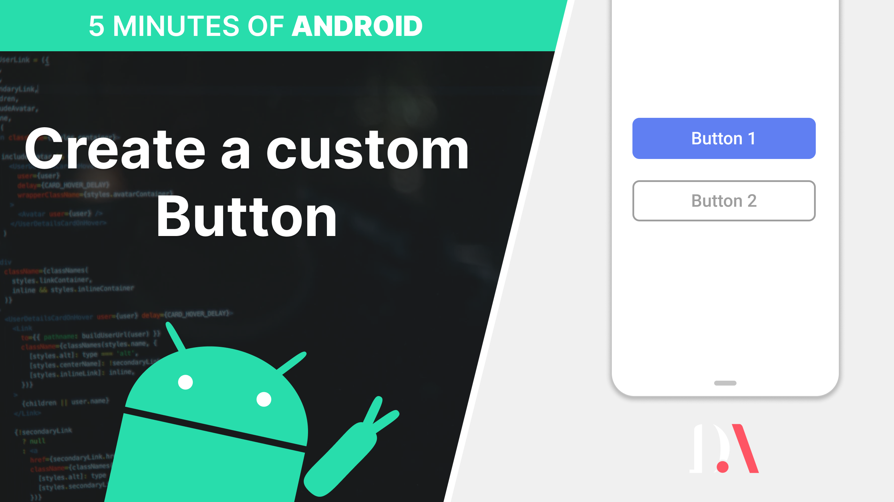

# Android Create a Custom button - Android tutorial
Create a custom button in an Android application

 
 
Source code for YouTube tutorial
- [YouTube video](https://www.youtube.com/watch?v=dJArJKn2d6s) - How to create a custom button in an Android application 

Subscribe to my channel to see more videos 
- [YouTube channel](https://www.youtube.com/c/davideagostini)